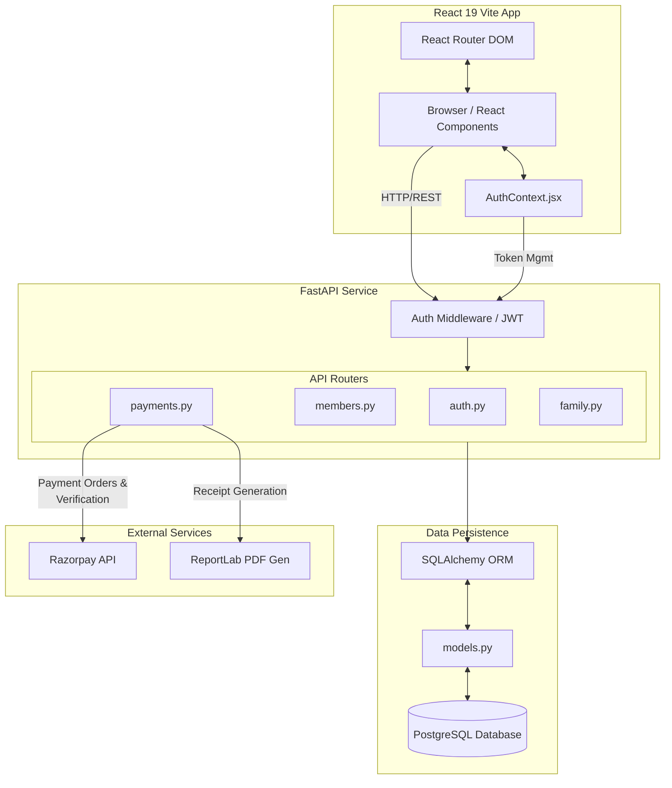

# Technical Architecture and Project Flow: Village Community Platform

## 1. System Architecture Diagram



## 2. File Interaction Map

### Frontend Routing and Authentication Context
* **`App.jsx`**: Acts as the root component that defines all application routes using `react-router-dom`. It wraps the entire application in the `AuthProvider` and uses a custom `ProtectedRoute` component to handle role and status-based routing (e.g., gating `/pay` to users with the `approved` status, and `/dashboard` to `member` status). Route-level code splitting is implemented using React's `lazy` and `Suspense`.
* **`AuthContext.jsx`**: Provides a global state for user authentication. It manages the JWT tokens (stored in `localStorage`), fetches the current user profile (`/auth/users/me`), and handles core auth flows like `login`, `register`, `requestUserOtp`, and `applyForMembership`. Individual React pages (e.g., `Profile.jsx`, `Donate.jsx`) consume this context via the `useAuth` hook to access user data and dispatch authentication methods.

### Backend Initialization and Routers
* **`main.py`**: The entry point for the FastAPI application. It initializes the FastAPI instance, configures CORS middleware to allow cross-origin requests from the React frontend, and manages the database lifespan (creating tables on startup via `Base.metadata.create_all()`). Crucially, it mounts all individual API routers using `app.include_router()`.
* **Routers (`auth.py`, `members.py`, `payments.py`, `family.py`)**: The backend logic is modularized into grouped routers. `auth.py` handles registration, login (JWT issuance), and OTP verification. `members.py` manages the membership directory, pending applications, and admin approvals. `payments.py` handles Razorpay integrations and ReportLab PDF receipt generation. `family.py` manages the family tree queries and modifications.

### Database Schema and Relationships
* **`models.py`**: Defines the SQLAlchemy ORM models and their relationships, mapping Python classes to PostgreSQL tables.
    * **User to Village**: A many-to-one relationship where a `User` belongs to one `Village` (`village_id` foreign key).
    * **User to Payments**: A one-to-many relationship where a `User` can have multiple `Payment` records tracking their transactions and membership fees.
    * **FamilyMember (Recursive)**: The `FamilyMember` model uses an adjacency list pattern for representing hierarchical trees. It has a `parent_id` foreign key pointing back to itself (`family_members.id`), allowing infinite nesting of parent-child family relationships. It also has a `user_id` pinpointing the owner of the tree, and an optional `linked_user_id` to softly link a family member record to an actual community `User` account.

## 3. Logic Flow: The Membership Lifecycle

The "Member Onboarding" flow involves a state-machine-like progression for a user:

1. **Registration (`Status: pending`)**:
   * The user fills out the signup form in the React frontend.
   * `AuthContext.jsx` calls the `/auth/register` endpoint in `auth.py`.
   * A new `User` row is created in the PostgreSQL database with the `status` column defaulting to `"pending"`.
   * The user submits their membership application details (village, address, etc.) via `/members/apply`.

2. **Admin Review (`Status: approved`)**:
   * An administrator logs into the system and accesses the Admin Dashboard (`Dashboard.jsx`).
   * The frontend fetches all pending applications from `/members/pending`.
   * The admin reviews and approves the application, triggering a PUT request to `/{member_id}/approve` in `members.py`.
   * The backend updates the user's `status` to `"approved"` and logs an initial `admin_comment`.

3. **Payment Processing (`Status: member` & Sabhasad ID Assignment)**:
   * The approved user logs in and is gated by `ProtectedRoute` to the `/pay` route (`PayMembership.jsx`).
   * The frontend calls `/payments/membership/create-order` to generate a Razorpay order ID.
   * The user completes the transaction via the Razorpay checkout modal.
   * Upon success, the frontend calls `/payments/membership/verify` with the Razorpay payment signature.
   * The `payments.py` router verifies the signature with the external Razorpay API. If valid, it records the payment, upgrades the user's `status` to `"member"`, and calls `generate_sabhasad_id()` to assign a sequential, unique Sabhasad ID (e.g., `eSAB-0001`).

## 4. Data Flow: Family Tree Recursion

The platform allows members to document their family hierarchy. Rather than sending flat relational rows to the frontend, the backend processes the data into a nested JSON structure.

1. **Flat Database Rows**: In PostgreSQL, `FamilyMember` records are stored fundamentally flat. Each child record has a `parent_id` joining to another `FamilyMember.id` (or null for root nodes).
2. **Backend Processing (`family.py`)**:
   * The `/family/tree` endpoint fetches all family records for a given logged-in `user_id`.
   * It initializes an empty dictionary map (`member_map`) keyed by `id`, where each member object is injected with an empty `children: []` array.
   * **The Recursion/Nesting Logic**: The code iterates linearly through the flat list of members. If a member has a `parent_id` that exists in the dictionary map, it appends itself directly to that parent's `children` array reference: `member_map[m.parent_id]["children"].append(member_map[m.id])`.
   * If a member has no `parent_id` (or the parent is not in the map), it is appended to a `roots` array.
3. **Structured Response**: Finally, it wraps the entire derived tree in a "Root" node representing the logged-in user themselves, returning a deeply nested JSON structure that the frontend can easily render recursively.

## 5. Deployment Structure: Environment-Aware API Switching

The React frontend requires dynamic API URLs depending on where it's deployed (local development vs. production server).

* **Context-Level Centralization**: The API base URL is determined using an environment-aware ternary operator at the top of `AuthContext.jsx` (and practically mirrored in files like `Profile.jsx` or `Donate.jsx`).
* **The Logic Expression**:
  ```javascript
  const API_URL = (
      window.location.hostname === 'localhost' || 
      window.location.hostname === '127.0.0.1' 
      ? 'http://127.0.0.1:8000' 
      : 'https://village-community-platform.onrender.com'
  );
  ```
* **Execution Strategy**: During local development (`localhost` or `127.0.0.1`), the `API_URL` dynamically resolves to the local FastAPI server running on port `8000`. In production, when hosted on services like Render, the frontend hostname automatically fails the condition, and the `API_URL` seamlessly switches to the production backend URL (`https://village-community-platform.onrender.com`). This ensures deployments work out-of-the-box without requiring complex `.env` replacements at runtime for the frontend static bundle.
